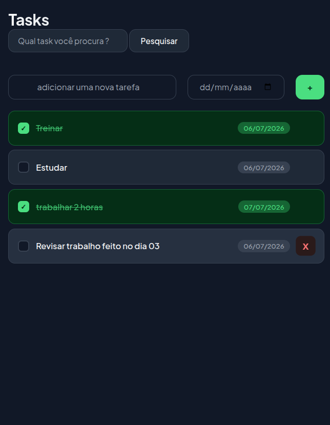

# ✅ To-Do List


## 📸 Preview



---

## 📌 Sobre o Projeto

Aplicação de lista de tarefas desenvolvida com HTML, CSS e JavaScript puro, sem frameworks ou bibliotecas externas. O foco foi em criar uma experiência de usuário fluida e moderna, com persistência de dados via `localStorage`.

---

## ✨ Funcionalidades

- ➕ Adicionar tarefas com nome e data de início
- ✅ Marcar tarefas como concluídas com feedback visual
- 🗑️ Remover tarefas individualmente
- 💾 Persistência de dados com `localStorage` — as tarefas não somem ao fechar o navegador
- 🔍 Campo de pesquisa para filtrar tarefas
- 📱 Layout responsivo para mobile

---

## 🎨 Design

- Tema escuro com tipografia moderna (Plus Jakarta Sans)
- Checkbox customizado com animação de conclusão
- Botão remover com hover em vermelho
- Animação de entrada suave ao adicionar tarefas
- Feedback visual em verde para tarefas concluídas

---

## 🧠 Conceitos Praticados

- Manipulação do DOM com `getElementById`, `querySelectorAll` e `createElement`
- Eventos com `addEventListener`
- Criação dinâmica de elementos com `appendChild`
- Persistência com `localStorage`, `JSON.stringify` e `JSON.parse`
- Funções reutilizáveis para evitar repetição de código
- Formatação de strings com template literals e `.split()`
- Alternância de classes com `classList.toggle`
- Escopo de variáveis em JavaScript

---

## 📂 Estrutura do Projeto

```
todo-list/
│
├── index.html      # Estrutura da página
├── style.css       # Estilização e animações
├── script.js       # Lógica da aplicação
└── assets/
    └── preview.png # Screenshot do projeto
```

---

## 🚀 Como Executar

1. Clone o repositório:
```bash
git clone https://github.com/seu-usuario/todo-list.git
```

2. Acesse a pasta:
```bash
cd todo-list
```

3. Abra o `index.html` no navegador — não precisa de servidor ou instalação.

---

## 👨‍💻 Autor

Feito por Samuel Arcanjo — [GitHub](https://github.com/SamukaArcanjo) · [LinkedIn](linkedin.com/in/samuel-arcanjo-3a2ba5274)

---

## 📄 Licença

Este projeto está sob a licença MIT. Veja o arquivo [LICENSE](LICENSE) para mais detalhes.